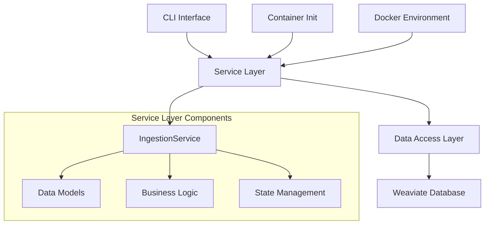
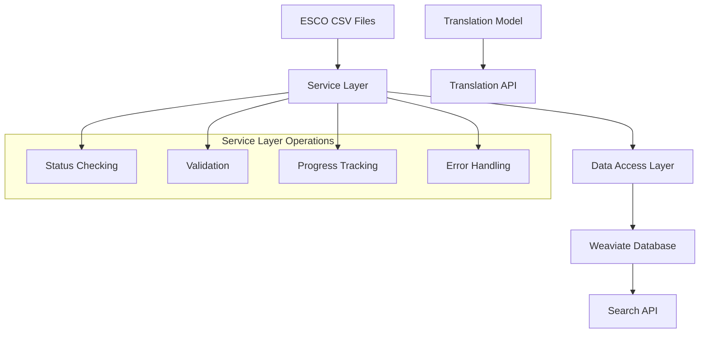

# Varity — ESCO Data Management and Search Tool

Varity is a tool for managing, searching, and translating the ESCO (European Skills, Competences, Qualifications and Occupations) taxonomy using Weaviate vector database. It provides a unified command-line interface for data ingestion, semantic search, and translation capabilities.

## Features

- **Service Layer Architecture**
  - Centralized business logic in service layer
  - Eliminates duplication between CLI and container initialization
  - Single source of truth for all ingestion operations
  - Structured data models for consistent state management
  - Comprehensive error handling and validation

- **Vector Database Architecture**
  - Weaviate for high-performance vector search
  - HNSW indexing for fast similarity search
  - Rich cross-references between entities
  - Configurable vector index parameters
  - Support for multiple vectorizers (Sentence Transformers, Contextuary)

- **Semantic Search**
  - Vector-based semantic search using HNSW index
  - Support for multiple entity types (Skills, Occupations, ISCO Groups)
  - Configurable similarity thresholds
  - Rich result formatting with related entities
  - Profile-based search with complete occupation details

- **Data Management**
  - Intelligent ingestion state management
  - Automatic prerequisite validation
  - Progress tracking with detailed status reporting
  - Batch ingestion with automatic retries
  - Cross-references between entities
  - Support for multiple languages
  - Efficient vector indexing
  - Selective class ingestion
  - Optional relationship creation

- **Translation**
  - Neural machine translation support
  - Batch processing capabilities
  - Multiple language pair support

## Prerequisites

- Python 3.8 or higher
- Weaviate Vector Database (version 1.25)
- ESCO CSV files (v1.2.0 or compatible)
- Docker and Docker Compose (for containerized deployment)

## Quick Start

1. Clone the repository:
```bash
git clone <repository-url>
cd varity
```

2. Start the services:
```bash
docker-compose up -d
```

3. Switch vectorizer (optional):
```bash
# Use sentence transformers (default)
./switch_vectorizer.sh sentence-transformers

# Use contextuary
./switch_vectorizer.sh contextuary
```

4. Download the translation model:
```bash
python src/esco_cli.py download-model
```

5. Ingest data:
```bash
# Ingest all data (with automatic status checking)
python src/esco_cli.py ingest --config config/weaviate_config.yaml

# Force re-ingestion
python src/esco_cli.py ingest --config config/weaviate_config.yaml --force-reingest

# Ingest specific classes
python src/esco_cli.py ingest --config config/weaviate_config.yaml --classes Skill Occupation

# Ingest with options
python src/esco_cli.py ingest --config config/weaviate_config.yaml --delete-all --skip-relations
```

6. Search the data:
```bash
# Basic search
python src/esco_cli.py search --query "python programming"

# Advanced search
python src/esco_cli.py search --query "python programming" --type Skill --limit 5 --certainty 0.7 --profile-search

# JSON output
python src/esco_cli.py search --query "python programming" --json
```

## Architecture

### Service Layer Pattern

The application follows a clean Service Layer architecture that separates concerns and eliminates code duplication:



**Key Components:**

1. **Application Layer (`src/application/services/`)**
   - `IngestionApplicationService`: Centralized business logic for all ingestion operations
   - `SearchApplicationService`: Search functionality and result processing
   - Handles status checking, validation, and orchestration
   - Provides unified interface for CLI and container initialization

2. **Core Entities (`src/core/entities/`)**
   - `IngestionEntity`: Core entities for ingestion operations
   - `SearchEntity`: Core entities for search operations
   - `ESCOEntity`: Base entity definitions
   - Structured data models for consistent state management

3. **Infrastructure Layer (`src/infrastructure/`)**
   - `database/`: Database access and client implementations
   - `external/`: External service integrations
   - Pure data access operations
   - No business logic or user interaction
   - Simplified ingestion methods focused on data persistence

4. **Presentation Layer (`src/presentation/`)**
   - `cli/`: Command-line interface implementation
   - `containers/`: Container initialization logic
   - User interaction and input handling
   - Command routing and response formatting

### Database Integration

The tool uses Weaviate as its primary database:

1. **Weaviate**
   - Stores vector embeddings
   - Provides semantic search
   - Manages cross-references
   - Uses HNSW indexing
   - Supports multiple languages
   - Handles complex relationships
   - Supports multiple vectorizers:
     - Sentence Transformers (all-MiniLM-L6-v2)
     - Contextuary

### Ingestion State Management

The service layer provides intelligent state management:

- **Automatic Status Detection**: Checks current ingestion state before starting
- **Stale Process Recovery**: Handles interrupted ingestion processes (>1 hour old)
- **Prerequisites Validation**: Verifies Weaviate connectivity and schema readiness
- **Progress Tracking**: Real-time progress updates with detailed step information
- **Error Recovery**: Structured error handling with actionable feedback

### Vectorizer Configuration

The system supports two vectorizers:

1. **Sentence Transformers**
   - Model: all-MiniLM-L6-v2
   - 384-dimensional embeddings
   - Optimized for semantic similarity
   - Default configuration

2. **Contextuary**
   - Specialized for contextual understanding
   - Alternative embedding model
   - Can be switched using the provided script

To switch between vectorizers:
```bash
# Switch to sentence transformers
./switch_vectorizer.sh sentence-transformers

# Switch to contextuary
./switch_vectorizer.sh contextuary
```

Note: Switching vectorizers requires re-ingesting the data as the embeddings will be different.

### Data Flow



## Configuration

### Weaviate Configuration

Create `config/weaviate_config.yaml`:
```yaml
default:
  weaviate:
    url: "http://localhost:8080"
    vector_index_config:
      distance: "cosine"
      efConstruction: 128
      maxConnections: 64
    batch_size: 100
    retry_attempts: 3
    retry_delay: 5
  app:
    data_dir: "data/esco"
    stale_timeout_hours: 1
    non_interactive: false

dev:
  weaviate:
    url: "http://localhost:8080"
    batch_size: 50
  app:
    data_dir: "data/esco"

prod:
  weaviate:
    url: "http://weaviate:8080"
    batch_size: 200
  app:
    data_dir: "/app/data"
    non_interactive: true
```

## Usage

### Data Ingestion

The ingestion system now provides intelligent status management and decision making:

```bash
# Basic ingestion (automatic status checking)
python src/esco_cli.py ingest --config config/weaviate_config.yaml

# Force re-ingestion (overrides status checks)
python src/esco_cli.py ingest --config config/weaviate_config.yaml --force-reingest

# Ingest specific classes
python src/esco_cli.py ingest --config config/weaviate_config.yaml --classes Skill Occupation

# Delete and re-ingest
python src/esco_cli.py ingest --config config/weaviate_config.yaml --delete-all

# Skip relationship creation
python src/esco_cli.py ingest --config config/weaviate_config.yaml --skip-relations

# Non-interactive mode (for automation)
NON_INTERACTIVE=true python src/esco_cli.py ingest --config config/weaviate_config.yaml
```

**Ingestion Behavior:**
- Automatically detects existing data and prompts user (interactive mode)
- Handles stale "in progress" states from interrupted processes
- Validates prerequisites before starting ingestion
- Provides real-time progress updates
- Comprehensive error reporting with actionable feedback

### Container-based Ingestion

The container initialization uses the same service layer for consistency:

```bash
# Start container-based ingestion
docker-compose up varity-init

# Check ingestion status
docker-compose logs varity-init
```

**Container Features:**
- Automatic retry logic for in-progress states
- Non-interactive mode by default
- Same validation and error handling as CLI
- Structured exit codes for orchestration

### Semantic Search

```bash
# Basic search
python src/esco_cli.py search --query "python programming"

# Search with options
python src/esco_cli.py search \
    --query "python programming" \
    --type Skill \
    --limit 5 \
    --certainty 0.7 \
    --profile-search

# JSON output
python src/esco_cli.py search --query "python programming" --json
```

### Translation

```bash
# Translate skills
python src/esco_cli.py translate --type Skill --property prefLabel

# Translate with options
python src/esco_cli.py translate \
    --type Skill \
    --property prefLabel \
    --batch-size 50 \
    --device mps
```

## Data Models

### Service Layer Models

The application uses structured data models for consistent state management:

1. **IngestionState** (Enum)
   - `NOT_STARTED`: No ingestion has been performed
   - `IN_PROGRESS`: Ingestion is currently running
   - `COMPLETED`: Ingestion completed successfully
   - `FAILED`: Ingestion failed with errors
   - `UNKNOWN`: Cannot determine current state

2. **IngestionDecision**
   - `should_run`: Whether ingestion should proceed
   - `reason`: Human-readable explanation
   - `current_state`: Current system state
   - `force_required`: Whether force flag is needed
   - `existing_classes`: List of classes with existing data

3. **IngestionProgress**
   - `current_step`: Description of current operation
   - `step_number`: Current step number
   - `total_steps`: Total number of steps
   - `progress_percentage`: Calculated progress percentage
   - `start_time`: When the operation started

4. **IngestionResult**
   - `success`: Whether operation succeeded
   - `steps_completed`: Number of steps completed
   - `total_steps`: Total number of steps
   - `errors`: List of error messages
   - `duration`: Total operation time

5. **ValidationResult**
   - `is_valid`: Whether validation passed
   - `details`: Detailed validation information
   - `errors`: List of validation errors
   - `warnings`: List of validation warnings

### Weaviate Vector Model

Collections:
1. **Occupation**
   - Properties:
     - `conceptUri` (string)
     - `code` (string)
     - `preferredLabel_en` (text)
     - `description_en` (text)
     - `definition_en` (text)
     - `iscoGroup` (string)
     - `altLabels_en` (text[])
   - Vector: 384-dimensional embedding
   - Cross-references:
     - `hasEssentialSkill` → Skill
     - `hasOptionalSkill` → Skill

2. **Skill**
   - Properties:
     - `conceptUri` (string)
     - `code` (string)
     - `preferredLabel_en` (text)
     - `description_en` (text)
     - `definition_en` (text)
     - `skillType` (string)
     - `reuseLevel` (string)
     - `altLabels_en` (text[])
   - Vector: 384-dimensional embedding

3. **ISCOGroup**
   - Properties:
     - `conceptUri` (string)
     - `code` (string)
     - `preferredLabel_en` (text)
     - `description_en` (text)
   - Vector: 384-dimensional embedding

4. **SkillCollection**
   - Properties:
     - `conceptUri` (string)
     - `preferredLabel_en` (text)
     - `description_en` (text)
   - Vector: 384-dimensional embedding

5. **SkillGroup**
   - Properties:
     - `conceptUri` (string)
     - `preferredLabel_en` (text)
     - `description_en` (text)
   - Vector: 384-dimensional embedding

## Performance

### Service Layer Benefits
- **Eliminated Code Duplication**: Single implementation for CLI and container usage
- **Improved Error Handling**: Structured error management with actionable feedback
- **Better State Management**: Intelligent handling of ingestion states and recovery
- **Enhanced Validation**: Comprehensive prerequisite checking before operations

### Batch Processing
- Configurable batch sizes (default: 100)
- Automatic retries for failed operations
- Efficient vector storage and indexing
- Real-time progress tracking

### Search Performance
- HNSW index for fast vector search
- Configurable index parameters
- Support for multiple devices (CPU, CUDA, MPS)

### Memory Usage
- Efficient vector storage
- Configurable batch sizes
- Automatic garbage collection

## Monitoring

### Health Checks
- Weaviate: Ready endpoint (8080)
- Automatic container restart
- Service layer status validation

### Logging
- Structured logging to `logs/esco.log`
- Console output with color coding
- Error tracking and reporting
- Service layer operation tracking

### Status Monitoring
```bash
# Check ingestion status via CLI
python src/esco_cli.py ingest --config config/weaviate_config.yaml --dry-run

# Container status
docker-compose ps
docker-compose logs varity-init
```

## Troubleshooting

### Common Issues

1. **Connection Problems**
   - Verify Weaviate URL in configuration
   - Check service health: `curl http://localhost:8080/v1/.well-known/ready`
   - Ensure ports are accessible

2. **Ingestion Failures**
   - Check service layer validation results
   - Verify CSV file formats and paths
   - Monitor memory usage and batch size settings
   - Use `--force-reingest` to override state checks

3. **Stale In-Progress States**
   - Service layer automatically detects stale processes (>1 hour)
   - Use `--force-reingest` to override if needed
   - Check for zombie processes

4. **Search Issues**
   - Verify embeddings generation completed
   - Check index status in Weaviate
   - Monitor search latency
   - Adjust certainty threshold

### Debugging

1. Enable verbose logging:
```bash
export LOG_LEVEL=DEBUG
```

2. Check container logs:
```bash
docker-compose logs -f varity-init
```

3. Monitor database status:
```bash
curl http://localhost:8080/v1/.well-known/ready
```

4. Service layer debugging:
```bash
# Dry run to check status without ingesting
python src/esco_cli.py ingest --config config/weaviate_config.yaml --dry-run

# Detailed validation
python -c "
from src.application.services.ingestion_application_service import IngestionService
from src.core.entities.ingestion_entity import IngestionConfig

config = IngestionConfig('config/weaviate_config.yaml', 'default')
service = IngestionService(config)
print('Current state:', service.get_current_state())
print('Should run:', service.should_run_ingestion())
validation = service.validate_prerequisites()
print('Validation:', validation.is_valid, validation.errors)
"
```

### Long-Running Ingestion

The ESCO data ingestion process is designed to handle large datasets and can take several hours to complete. This is normal behavior and not an indication of a problem.

#### Expected Duration
- Full ingestion typically takes 2-4 hours depending on system resources
- Each step (occupations, skills, relations) may take 30-60 minutes
- Progress is tracked and reported through heartbeat messages

#### Monitoring Progress
- Check the logs for step-by-step progress updates
- Each step reports its current progress and estimated completion time
- Heartbeat messages are sent every 30 seconds by default

#### Common Scenarios

1. **Slow but Active Ingestion**
   - If you see regular heartbeat messages and step progress updates
   - This is normal - continue waiting
   - Monitor the logs for progress updates

2. **Stuck Ingestion**
   - No heartbeat updates for more than 2 hours
   - No progress updates for extended periods
   - Error messages in the logs

#### Troubleshooting Steps

1. For Slow Ingestion:
   - Monitor the logs for progress updates
   - Check system resources (CPU, memory, disk I/O)
   - Verify network connectivity to Weaviate
   - Consider adjusting batch sizes in configuration

2. For Stuck Ingestion:
   - Check the logs for error messages
   - Verify the last heartbeat timestamp
   - Check Weaviate connection status
   - Restart the ingestion process if necessary

### Configuration

The system uses configurable timeouts and polling intervals:

```yaml
app:
  ingestion_wait_timeout_minutes: 60  # Maximum time to wait for ingestion
  ingestion_poll_interval_seconds: 30  # How often to check ingestion status
  staleness_threshold_seconds: 7200    # When to consider ingestion stale
```

Adjust these values based on your system's performance and requirements.

## Development

### Project Structure
```
varity/
├── config/
│   └── weaviate_config.yaml
├── src/
│   ├── models/                    # Service layer data models
│   │   ├── __init__.py
│   │   └── ingestion_models.py
│   ├── services/                  # Service layer business logic
│   │   ├── __init__.py
│   │   └── ingestion_service.py
│   ├── esco_cli.py               # CLI interface (refactored)
│   ├── init_ingestion.py         # Container initialization (refactored)
│   ├── esco_ingest.py            # Data access layer (refactored)
│   ├── esco_weaviate_client.py
│   ├── weaviate_search.py
│   ├── weaviate_semantic_search.py
│   ├── embedding_utils.py
│   ├── esco_translate.py
│   ├── download_model.py
│   ├── logging_config.py
│   └── exceptions.py
├── scripts/
│   └── init_ingestion.sh         # Container shell script (updated)
├── resources/
│   └── schemas/
│       ├── occupation.yaml
│       ├── skill.yaml
│       ├── isco_group.yaml
│       ├── skill_collection.yaml
│       ├── skill_group.yaml
│       └── references.yaml
└── docker-compose.yml
```

### Service Layer Development

When extending the service layer:

1. **Add new data models** in `src/models/ingestion_models.py`
2. **Extend service methods** in `src/services/ingestion_service.py`
3. **Update CLI interface** in `src/esco_cli.py` to use new service methods
4. **Keep data access pure** in `src/esco_ingest.py` (no business logic)

### Testing Service Layer

```python
# Example service layer usage
from src.application.services.ingestion_application_service import IngestionService
from src.core.entities.ingestion_entity import IngestionConfig

# Create configuration
config = IngestionConfig(
    config_path="config/weaviate_config.yaml",
    profile="default",
    force_reingest=False,
    non_interactive=False
)

# Initialize service
service = IngestionService(config)

# Check current state
state = service.get_current_state()
print(f"Current state: {state}")

# Get ingestion decision
decision = service.should_run_ingestion()
print(f"Should run: {decision.should_run}, Reason: {decision.reason}")

# Validate prerequisites
validation = service.validate_prerequisites()
print(f"Valid: {validation.is_valid}")

# Run ingestion (if needed)
if decision.should_run:
    result = service.run_ingestion()
    print(f"Success: {result.success}")
```

## Contributing

1. Fork the repository
2. Create a feature branch
3. Follow the Service Layer pattern for new features
4. Make your changes
5. Submit a pull request

## License

This project is licensed under the MIT License - see the LICENSE file for details.

## Acknowledgments

- ESCO for the taxonomy data
- Weaviate for the vector database
- All contributors and users 